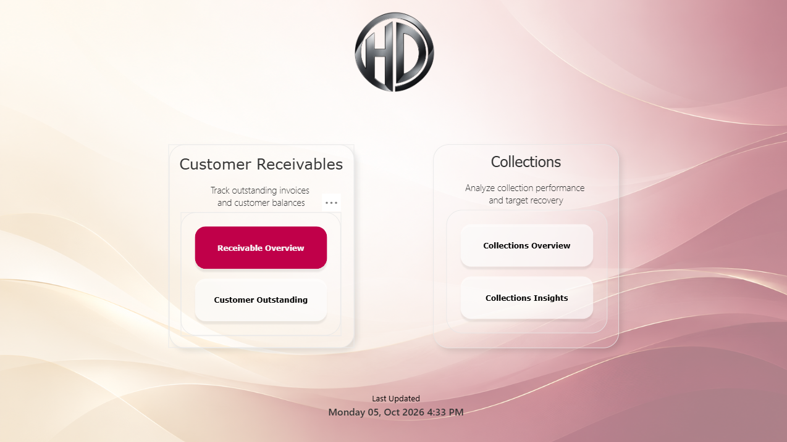
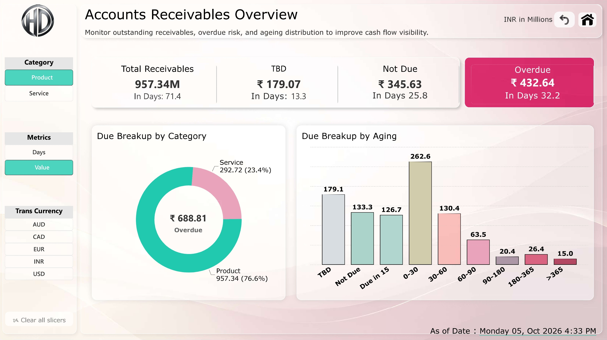
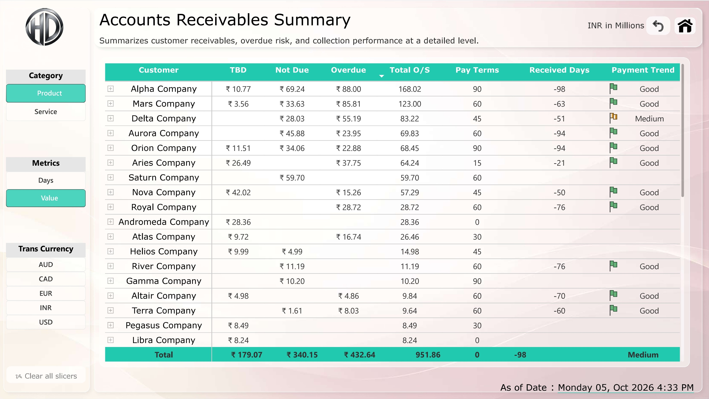
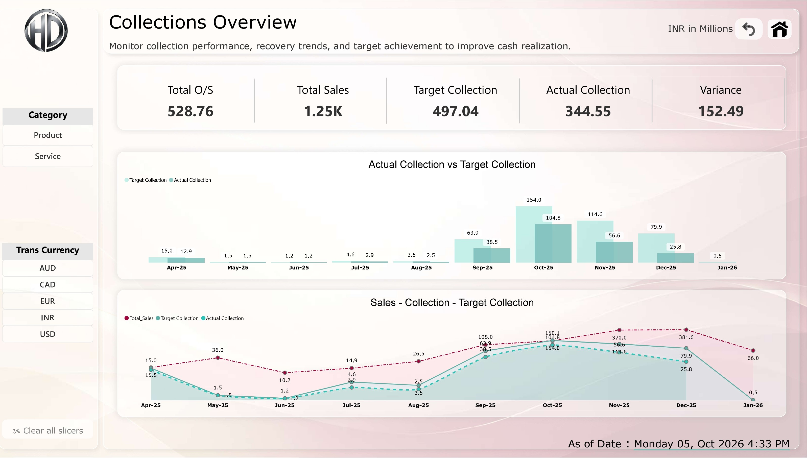
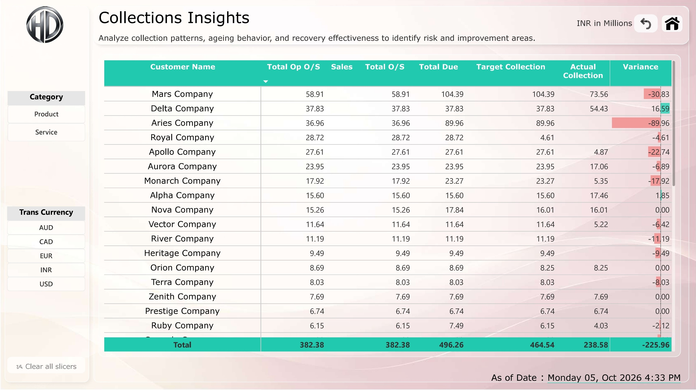

# Customer Receivables & Collections Analysis

## Power BI Financial Analytics Dashboard

An interactive Power BI dashboard designed to analyze customer receivables, outstanding balances, aging exposure, and collection performance.

The report provides a consolidated view of receivables and collections to help identify overdue exposure, understand customer-level outstanding balances, monitor collection performance, and support cash-flow visibility.

---

## Project Overview

Customer receivables management is critical for maintaining healthy cash flow and reducing overdue exposure.

This Power BI solution transforms receivables and collection data into an interactive analytical report covering:

- Total receivables
- Outstanding balances
- Overdue receivables
- Receivables aging
- Customer-level outstanding analysis
- Collection targets vs actual collections
- Collection performance
- Collection trends
- Aging exposure
- Customer collection insights

The report is structured to provide both management-level visibility and detailed customer-level analysis.

---

## Business Objectives

The primary objectives of this dashboard are to:

- Monitor total customer receivables
- Identify overdue receivables
- Analyze receivables by aging period
- Understand customer-level outstanding exposure
- Compare collection targets with actual collections
- Monitor collection efficiency
- Identify customers contributing to overdue balances
- Improve visibility into receivables and cash-flow performance

---

## Report Structure

The report contains five main pages.

### 1. Navigation

Provides centralized navigation between the analytical sections of the report.

---

### 2. Receivable Overview

Provides a high-level overview of customer receivables.

Key areas include:

- Total Receivables
- TBD / pending receivables
- Not Due receivables
- Overdue receivables
- Receivables by category
- Aging distribution
- Transaction currency filtering

---

### 3. Customer Outstanding

Provides customer-level analysis of outstanding receivables.

This page helps identify:

- Customer outstanding balances
- Overdue exposure
- Aging distribution
- Customer-level receivable concentration
- Customers requiring collection attention

---

### 4. Collections Overview

Provides an overview of collection performance against expected/target collections.

Key analysis includes:

- Collection target
- Actual collections
- Collection variance
- Collection trends
- Customer collection performance
- Collection status

---

### 5. Collections Insights

Provides deeper analysis of collection behavior and performance.

The page is designed to help identify:

- Collection efficiency
- Customer collection patterns
- Collection performance gaps
- Aging-related collection risks
- Areas requiring management attention

---

## Key KPIs

The dashboard focuses on the following financial and collection KPIs:

| KPI | Purpose |
|---|---|
| Total Receivables | Measures total customer receivable exposure |
| Overdue Receivables | Identifies receivables beyond their expected due date |
| Not Due | Measures receivables that are currently within the agreed payment period |
| TBD | Identifies receivables requiring further classification/action |
| Collection Target | Represents expected collection amount |
| Actual Collection | Measures collections received |
| Collection Variance | Highlights the difference between target and actual collection |
| Aging Days | Measures the number of days receivables remain outstanding |

---

## Aging Analysis

Receivables are analyzed using aging buckets to identify the level of collection risk.

The report includes aging categories such as:

- Not Due
- 0–30 Days
- 30–60 Days
- 60–90 Days
- 90–180 Days
- 180–365 Days
- More than 365 Days

This allows users to quickly identify older outstanding balances requiring collection attention.

---

## Technology Stack

- Microsoft Power BI
- Power Query
- DAX
- Data Modeling
- Data Visualization
- Financial / Receivables Analytics

---

## Power BI Concepts Demonstrated

This project demonstrates practical implementation of:

- Data transformation
- Data modeling
- Relationship management
- DAX measures
- KPI development
- Aging analysis
- Financial analytics
- Interactive slicers
- Drill-down analysis
- Conditional analysis
- Dashboard navigation
- Business-focused data visualization

---

## Dashboard Features

### Interactive Filtering

Users can interact with the report using filters such as:

- Category
- Metrics
- Transaction Currency
- Customer
- Aging-related dimensions

### Dynamic Analysis

The report allows users to move from:

**Overall Receivables → Aging → Customer Outstanding → Collections → Collection Insights**

This provides a structured analytical flow from management overview to detailed analysis.

---

## Business Value

The dashboard can help finance and management teams:

- Improve visibility into receivables
- Identify overdue customer balances
- Prioritize collection activities
- Monitor collection performance
- Identify aging-related risks
- Compare expected and actual collections
- Improve cash-flow planning
- Support data-driven receivables management

---

## Data Privacy

The dataset used in this portfolio project has been anonymized.

Customer names and identifying business information have been replaced with fictional names for demonstration purposes.

No confidential client data is intentionally included in this repository.

The project focuses on demonstrating the Power BI analytical approach, data modeling, visualization, and business logic rather than exposing real customer information.

---

## Project Files

### Power BI Report

[**Customer Receivables & Collections Analysis (.pbix)**](Customer_Receivables_Collections_Analysis.pbix)

---

## Author

**Power BI / Data Analytics Portfolio Project**

Skills demonstrated:

**Power BI | DAX | Power Query | Data Modeling | Financial Analytics | Data Visualization**
